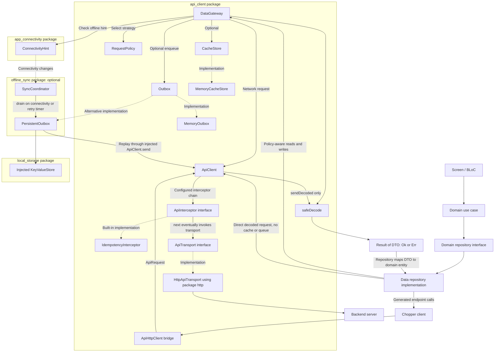
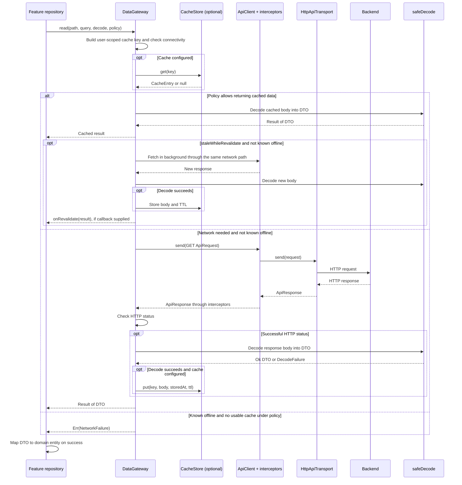
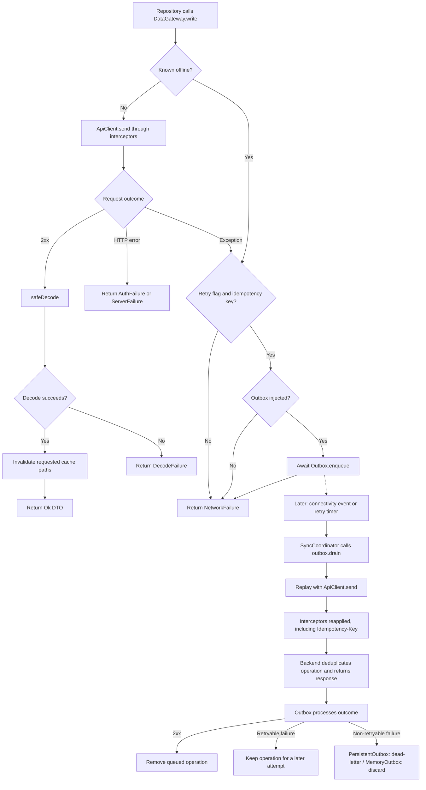
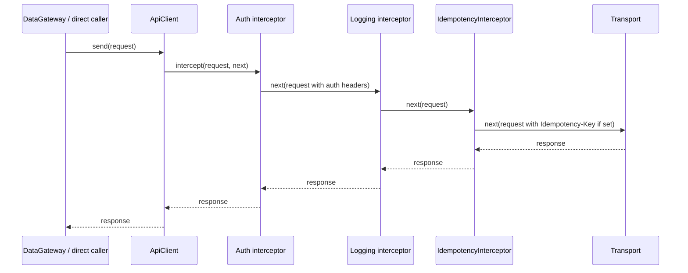

# API Client: Component Connections

This document describes the current implementation. Diagrams use Mermaid;
open this file in a Markdown viewer with Mermaid support to render them.
Arrows in the overview represent calls or injected collaborators, not Dart
package dependencies. The app composes these objects; not every app must use
every optional component.

## 1. Overall structure

`DataGateway`, `ApiClient`, and `ApiHttpClient` are classes inside the **same
api_client package**. Nodes are declared inside their owning package before
any cross-package edges so the rendered boundaries reflect that ownership.

- `ApiClient` owns sending and interceptor composition, not caching or queuing.
- `DataGateway` adds those policies on top of `ApiClient`.
- `ApiHttpClient` adapts Chopper/http calls into `ApiClient`; it does not pass
  through `DataGateway` and does not automatically apply its read/write policies.
- `HttpApiTransport` is the opposite end: it turns `ApiRequest` into real HTTP.
- Connectivity implementation lives in `app_connectivity`; `api_client`
  re-exports its interface. A possibly-online signal is not proof of internet access.
- Domain code owns the repository interface. The arrow to its implementation
  represents runtime dispatch, not a domain import of the data layer.

## 2. Reading data

The network path is shared by every strategy. These rules determine when it runs:

- `networkOnly`: do not return cache. A successful fetch can still populate an
  injected cache in the current implementation.
- `cacheFirst`: use fresh cache; also accept expired cache when known offline.
- `networkFirst`: try network, then fall back to cache only for `NetworkFailure`.
- `staleWhileRevalidate`: return any cached entry immediately and fetch again
  when not known offline; this refresh happens even if the cache is still fresh.
- Without a cache, the effective strategy is `networkOnly`.

`DataGateway` coalesces concurrent GETs sharing a cache key. Callers sharing that
key must use compatible result types/decoders: the in-flight result is already
decoded, not a raw response. GET exceptions trigger one extra immediate attempt;
HTTP error responses and decode failures do not trigger that retry. The current
catch handles all exceptions, not only transport-specific exceptions.

## 3. Writing data and retrying after reconnect

Important boundaries:

- Both `retryOnReconnect: true` and a usable, stable `idempotencyKey` are needed
  for safe retry. The server must implement deduplication for that key.
- Enqueued does **not** mean completed on the server. `write()` currently returns
  `NetworkFailure` rather than a dedicated queued result.
- With no outbox, nothing is queued. The current offline branch can still say
  `Queued until online`; do not use that message as proof of persistence.
- An HTTP 5xx returned by the initial write is currently returned as a server
  failure, not automatically enqueued. Retryable HTTP handling in the diagram
  applies to operations already in the outbox.
- Replay goes through `ApiClient.send`, not `DataGateway.write`. Therefore it
  does not automatically re-run DTO decoding, cache invalidation, or UI refresh.
  App/repository-level synchronization must handle those effects separately.
- `MemoryOutbox` has no persistence or retry timer. The reconnect/timer path
  requires an app-composed coordinator such as `offline_sync.SyncCoordinator`.
- This queue does not guarantee execution while the OS suspends or kills the app.

## 4. Interceptor order

This is an illustrative configured order, not an automatic/default list:

`ApiClient.send()` constructs the chain using `interceptors.reversed` so that
the first interceptor in the configured list is the first to receive requests.
An interceptor can modify requests, inspect responses, short-circuit, or call
`next` again according to its implementation. Auth refresh and logging live in
separate packages and must be injected by the app.

## 5. Where to start reading the code

1. [api_types.dart](lib/src/api_types.dart): request, response and interfaces.
2. [api_client.dart](lib/src/api_client.dart): interceptor chain and direct decoding.
3. [http_api_transport.dart](lib/src/http_api_transport.dart): real HTTP I/O.
4. [data_gateway.dart](lib/src/data_gateway.dart): read/write policy orchestration.
5. [request_policy.dart](lib/src/request_policy.dart),
   [cache_store.dart](lib/src/cache_store.dart), and
   [safe_decode.dart](lib/src/safe_decode.dart): policy, cache and decoding helpers.
6. [outbox.dart](lib/src/outbox.dart) and [offline_sync](../offline_sync/README.md):
   queue boundary, durable storage and replay coordination.
7. [api_http_client.dart](lib/src/api_http_client.dart): Chopper/http bridge.
